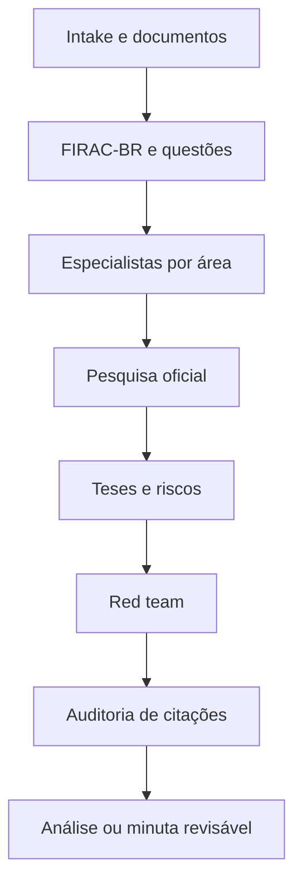

# JURIDICA

Sistema modular de inteligência jurídica para o Direito brasileiro, orientado por fontes oficiais, raciocínio estruturado, especialistas por área, revisão adversarial e auditoria de citações.

O agente adota uma persona jurídica sênior, com repertório simulado equivalente a mais de 50 anos de prática acumulada entre diferentes especialidades. Essa formulação descreve amplitude de análise; não constitui experiência profissional real, inscrição na OAB ou habilitação para representar terceiros.

> **Status:** versão inicial funcional. O projeto não substitui advogado, defensor, procurador, contador ou outro profissional habilitado. Toda peça, contrato ou decisão de alto impacto deve ser revisada antes do uso.

## O que este projeto faz

O JURIDICA organiza o trabalho de IA jurídica em cinco camadas:

1. **Intake e classificação:** entende objetivo, partes, foro, datas, documentos e urgência.
2. **Raciocínio brasileiro:** estrutura fatos, questões, regras, aplicação e conclusão.
3. **Especialização:** aciona módulos materiais e processuais adequados.
4. **Verificação:** consulta fontes oficiais, valida teses e audita citações.
5. **Revisão adversarial:** testa a análise pela perspectiva da parte contrária.

## Capacidades incluídas

- análise de caso e estratégia jurídica;
- organização de cronologia e provas;
- pesquisa legislativa e jurisprudencial;
- análise e revisão de contratos;
- análise de petições e documentos processuais;
- elaboração de pareceres, notificações e minutas;
- compliance e avaliação regulatória;
- due diligence jurídica;
- apoio a negociação e acordo;
- investigação documental lícita;
- auditoria de citações e red team jurídico;
- módulos de Civil, Consumidor, Empresarial, Contratos, Trabalhista, Tributário, Previdenciário, Imobiliário, Família, Sucessões, Penal, Constitucional, Administrativo, Digital, LGPD e Processual.

## Arquitetura

```text
juridica/
├── AGENTS.md
├── README.md
├── SKILL.md
├── orchestrator/managing-partner/
├── skills/
│   ├── brasil/
│   │   ├── raciocinio-juridico/
│   │   ├── civil/
│   │   ├── consumidor/
│   │   ├── empresarial/
│   │   ├── contratos/
│   │   ├── trabalhista/
│   │   ├── tributario/
│   │   ├── previdenciario/
│   │   ├── imobiliario/
│   │   ├── familia/
│   │   ├── sucessoes/
│   │   ├── penal/
│   │   ├── constitucional/
│   │   ├── administrativo/
│   │   ├── digital/
│   │   ├── lgpd/
│   │   └── processual/
│   ├── capacidades/
│   │   ├── peticao-analyzer/
│   │   ├── jurisprudencia-miner/
│   │   ├── tese-juridica-validator/
│   │   ├── sentenca-judicial-br/
│   │   ├── despacho-generator/
│   │   ├── checklist-saneamento/
│   │   ├── calculadora-processual/
│   │   ├── audiencia-analyzer/
│   │   ├── conciliacao-assistant/
│   │   ├── contrato-analyzer-br/
│   │   ├── dje-monitor/
│   │   ├── lex-document-ocr/
│   │   ├── lex-rag-builder/
│   │   └── academic-writer-br/
│   ├── jurisprudencia/
│   ├── contratos/
│   ├── compliance/
│   ├── due-diligence/
│   ├── negociacao/
│   ├── investigacao/
│   ├── legal-research/
│   ├── legal-writing/
│   └── document-review/
├── agents/
├── red-team/
├── templates/
├── sources/
├── references/
└── scripts/
```

## Fluxo operacional



## Metodologia FIRAC-BR

O núcleo usa uma adaptação operacional de Facts, Issues, Rules, Application e Conclusion ao contexto brasileiro. O método organiza o raciocínio, mas não substitui requisitos legais próprios de cada documento ou procedimento.

### F — Fatos

Organiza fatos comprovados, alegados e controvertidos; sujeitos; relação jurídica; datas; documentos; lacunas e impacto probatório.

### I — Questões

Decompõe o caso em questões materiais, processuais, probatórias, temporais e de competência.

### R — Regras

Identifica Constituição, legislação, regulamentação, precedentes qualificados, súmulas e jurisprudência. Vigência e teor devem ser conferidos na fonte oficial.

### A — Aplicação

Relaciona cada requisito jurídico aos fatos e às provas, expõe exceções e distingue precedentes quando necessário.

### C — Conclusão

Entrega resposta proporcional à evidência, com força da tese, riscos, dependências, alternativas e próximos passos.

## Protocolo anti-invenção

| Nível | Uso | Regra |
| --- | --- | --- |
| `CONFIRMADO` | Fonte oficial acessada e metadados conferidos | Pode sustentar a conclusão |
| `A CONFIRMAR` | Referência plausível, mas incompleta | Não sustenta sozinha conclusão definitiva |
| `NÃO VERIFICADO` | Dados insuficientes | Não apresentar como autoridade |

O sistema não pode inventar números de processos, artigos, súmulas, temas, relatores, datas, ementas, índices, URLs ou estado de vigência.

## Instalação como skill do Codex

```bash
cp -R juridica "${CODEX_HOME:-$HOME/.codex}/skills/juridica"
```

Depois, invoque:

```text
Use $juridica para analisar este caso segundo o Direito brasileiro, validar fontes oficiais e expor os riscos.
```

## Uso por outro agente

O `SKILL.md` é o roteador principal. O agente lê apenas os módulos relacionados ao caso. O `AGENTS.md` contém regras globais e o orquestrador atua em casos multidisciplinares ou de alto impacto.

## Habilidades operacionais

| Habilidade | Resultado principal |
| --- | --- |
| `peticao-analyzer` | Mapa de causas, argumentos, pedidos, provas e defesas |
| `jurisprudencia-miner` | Precedentes favoráveis e contrários validados |
| `tese-juridica-validator` | Força da tese em cinco dimensões |
| `sentenca-judicial-br` | Minuta estruturada e revisável |
| `despacho-generator` | Minuta adequada à fase informada |
| `checklist-saneamento` | Questões, fatos, provas e providências |
| `calculadora-processual` | Memória de cálculo com parâmetros explícitos |
| `audiencia-analyzer` | Síntese de falas, fatos e contradições |
| `conciliacao-assistant` | Cenários, proposta e minuta de termos |
| `contrato-analyzer-br` | Matriz de cláusulas, riscos e redações |
| `dje-monitor` | Publicações estruturadas e prazos a confirmar |
| `lex-document-ocr` | Extração por página com confiança indicada |
| `lex-rag-builder` | Arquitetura de base jurídica rastreável |
| `academic-writer-br` | Pesquisa e redação acadêmica verificável |

## Exemplos

```text
Use $juridica para organizar fatos, provas e questões jurídicas deste caso de negativação.
```

```text
Use $juridica para revisar este contrato, apresentar matriz de riscos e propor redações alternativas.
```

```text
Use $juridica para elaborar minuta de parecer com legislação e precedentes confirmados em fontes oficiais.
```

## Padrão de entrega

1. conclusão executiva;
2. escopo, jurisdição e data de corte;
3. cronologia, fatos e documentos;
4. questões jurídicas;
5. base normativa;
6. jurisprudência;
7. aplicação aos fatos;
8. tese contrária e revisão adversarial;
9. força da tese e riscos;
10. lacunas, documentos necessários e próximos atos;
11. fontes oficiais;
12. aviso de revisão profissional.

## Fontes

O catálogo em `sources/REGISTRY.yml` aponta para portais oficiais de legislação, tribunais e órgãos institucionais. URLs e disponibilidade podem mudar; o agente confirma o destino no momento da consulta.

## Segurança e privacidade

- Remova ou masque dados pessoais não necessários.
- Não envie documentos sigilosos a serviços externos sem autorização.
- Não armazene tokens, senhas ou certificados no repositório.
- Não protocole, assine, envie ou contate terceiros sem autorização expressa.

## Validação

```bash
python3 scripts/validate_repository.py
python3 /caminho/skill-creator/scripts/quick_validate.py .
```

## Projetos de referência

O desenho metodológico foi inspirado e adaptado a partir de projetos públicos:

- [Lex Intelligentia Skills](https://github.com/ma-serra/lex-intelligentia-skills), licenciado sob MIT, para FIRAC aplicado ao Brasil, análise de petições, validação de teses, jurisprudência, OCR e RAG jurídico;
- [GLAW](https://github.com/rikitrader/glaw), para orquestração e revisão adversarial;
- [Legal Skills Open](https://github.com/ThomasMoreAI/legal-skills-open), para modularidade;
- [Advogado Especialista](https://github.com/sickn33/agentic-awesome-skills/tree/main/skills/advogado-especialista), para cobertura temática.

Este repositório contém redação própria e não incorpora bibliotecas externas inteiras. Consulte `NOTICE.md`.

## Licença

MIT. Consulte `LICENSE`.
